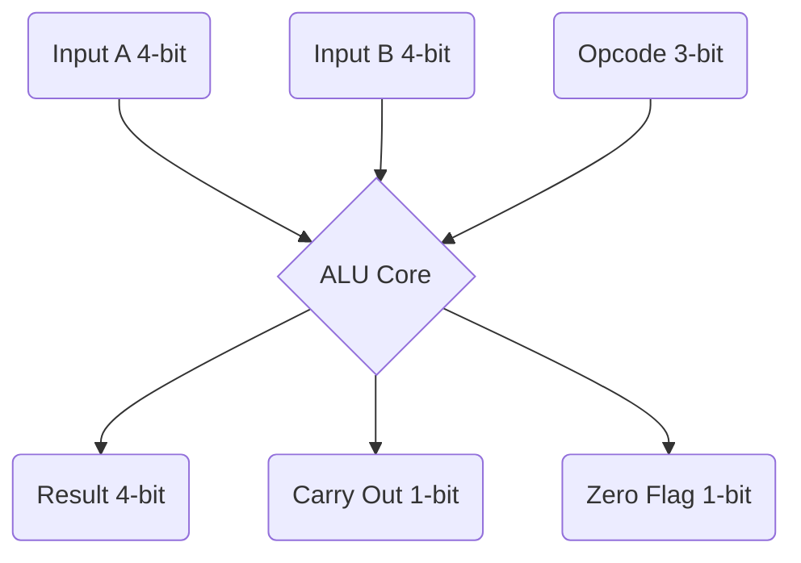

# 🚀 Ausome 4-bit ALU

An incredibly amazing ("ausome") 4-bit Arithmetic Logic Unit (ALU) implemented in Verilog. This project provides a fully functional ALU capable of performing basic arithmetic and logical operations, complete with a comprehensive testbench.

## 🌟 Features

* **4-bit Data Path:** Processes 4-bit inputs (`a` and `b`) to produce a 4-bit `result`.
* **8 Operations:** Supports a versatile set of 8 distinct operations.
* **Flags:** Provides `carry_out` (for arithmetic and shift operations) and `zero` flags.
* **Fully Tested:** Includes a Verilog testbench (`tb_alu.v`) to ensure correctness.
* **Easy Build:** Uses a simple `Makefile` for compiling and running with Icarus Verilog (`iverilog`).

## 🛠️ Supported Operations

| Opcode | Operation | Description |
| :--- | :--- | :--- |
| `000` | ADD | `a + b` |
| `001` | SUB | `a - b` |
| `010` | AND | `a & b` |
| `011` | OR | `a \| b` |
| `100` | XOR | `a ^ b` |
| `101` | NOT | `~a` (Bitwise NOT of A) |
| `110` | SHL | `a << 1` (Shift Left Logical) |
| `111` | SHR | `a >> 1` (Shift Right Logical) |

## 🏗️ Block Diagram



## 🚀 Getting Started

### Prerequisites

You will need an environment with `make` and Icarus Verilog (`iverilog`) installed.

### Running the Tests

To compile and run the simulation, simply execute the following command in your terminal:

```bash
make
```

This command will:
1. Compile `alu.v` and `tb_alu.v` using `iverilog`.
2. Generate an executable named `alu_test`.
3. Run the executable using `vvp`, which will print the test results to the console.

To clean up the generated files, run:

```bash
make clean
```
