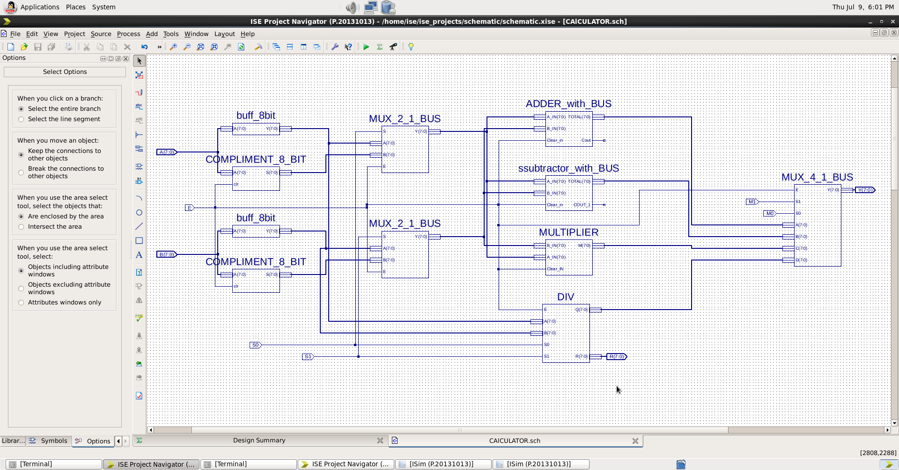
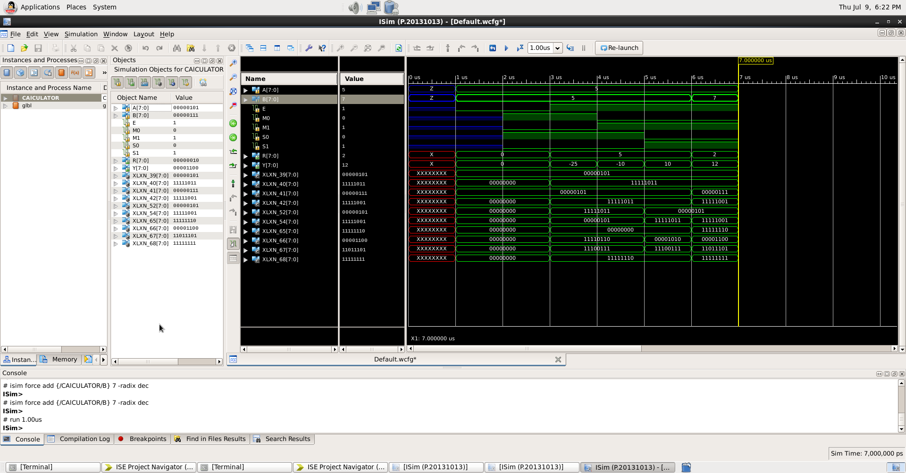

# 🧮 4-Bit Hardware Calculator (ALU System Architecture)


> [!NOTE]
> **Component Library:** This system integrates custom arithmetic modules developed and verified in my [Digital-Logic-and-Verilog-Design](https://github.com/himanshushukla0/Digital-Logic-Design) library.

---

## 📑 Table of Contents
- [Introduction & Executive Summary](#-introduction--executive-summary)
- [System Architecture](#️-system-architecture)
- [Instruction Set (Operation Codes)](#-instruction-set-operation-codes)
- [Simulation & Verification](#-simulation--verification)
- [Repository Structure](#-repository-structure)
- [Tech Stack / Tools Used](#-tech-stack--tools-used)
- [How to Run / Simulate](#-how-to-run--simulate)

---

## 🚀 Introduction & Executive Summary
This project represents a complete, system-level Arithmetic Logic Unit (ALU) designed entirely from fundamental logic gates using a bottom-up methodology. It integrates custom-built 4-bit adders, subtractors, array multipliers, and universal dividers into a cohesive calculator architecture. 

By utilizing standardized 8-bit overarching data buses and a central multiplexed control unit, this system dynamically routes input operands to execute selectable mathematical operations, mirroring the core instruction decoding processes found in real-world microprocessors.

**Key Features:**
* **Gate-Level Precision:** Built from fundamental logic gates.
* **4-Bit Cores:** Custom adders, subtractors, multipliers, and dividers.
* **Standardized Buses:** 8-bit overarching data pathways.
* **Instruction Decoding:** A central multiplexed control unit for dynamic mathematical operations.

---

## 🏗️ System Architecture

Unlike isolated components, this calculator requires a highly structured data path. Below is the top-level schematic acting as the system's block diagram:



**Architectural Highlights:**
1. **Parallel Execution:** Input operands flow into all four arithmetic execution cores simultaneously.
2. **Instruction Decoding:** The final `MUX_4_1_BUS` acts as the control unit, using select lines to determine which core's calculated answer is passed to the final output bus.
3. **Signed Logic Integration:** Includes 2's complement buffers and input multiplexers to handle both signed and unsigned data effectively.

---

## 🕹️ Instruction Set (Operation Codes)

To operate the calculator, a 2-bit control signal (`M1, M0`) is used to route the correct mathematical operation to the final output `Y(7:0)`.

| Op-Code (M1, M0) | Selected Operation | Mathematical Expression | Active Output Format |
| :---: | :--- | :--- | :--- |
| `0 0` | **Addition** | Output = A + B | 8-Bit Sum |
| `0 1` | **Subtraction** | Output = A - B | 8-Bit Difference |
| `1 0` | **Multiplication** | Output = A * B | 8-Bit Product |
| `1 1` | **Division** | Output = A / B | 4-Bit Quotient, 4-Bit Remainder |

---

## 📊 Simulation & Verification

Hardware design requires rigorous verification. Below is the ISim behavioral simulation proving the routing and execution of the ALU control logic.



**Verification Process:**
* The input operands `A` and `B` are established.
* The operation select lines (`M1, M0`) are toggled sequentially.
* The output bus cleanly transitions between the Sum, Difference, Product, and Quotient without any logic hazards or floating states, proving the multiplexer routing is flawless.

---

## 📂 Repository Structure

```text
├── CALCULATOR.png         # High-level system block diagram
├── CALCULATOR.jhd         # JHD configuration file for schematic
├── CALCULATOR.sch         # Top-level schematic diagram (Xilinx ISE)
├── CALCULATOR.vf          # Verilog representation of the system
├── CALCULATOR_beh.prj     # Simulation project file
├── README.md              # Project documentation
└── SIM_CALCULATOR.png     # ISim Behavioral Simulation output
```

---

## 🛠️ Tech Stack / Tools Used

* **Xilinx ISE (14.7):** Primary IDE for hardware design and logic synthesis.
* **Verilog HDL:** Hardware Description Language used for module verification and instantiation.
* **ISim:** Simulation engine for testing behavioral models and waveform generation.

---

## 🏃 How to Run / Simulate

1. **Clone the repository:**
   ```bash
   git clone https://github.com/himanshushukla0/4-Bit-ALU-Architecture.git
   ```
2. **Open in Xilinx ISE:**
   Launch Xilinx ISE and open a new project. Add all the included files (`CALCULATOR.sch`, `CALCULATOR.vf`, `CALCULATOR.jhd`) to your design sources.
3. **Run Simulation:**
   * Select `CALCULATOR_beh.prj` or the top-level schematic in the **Simulation** view.
   * Launch **ISim Simulator** (Simulate Behavioral Model).
   * Apply test bench values to `A(3:0)` and `B(3:0)` and toggle `M(1:0)` operands to verify routing functionality against the provided `SIM_CALCULATOR.png`.
